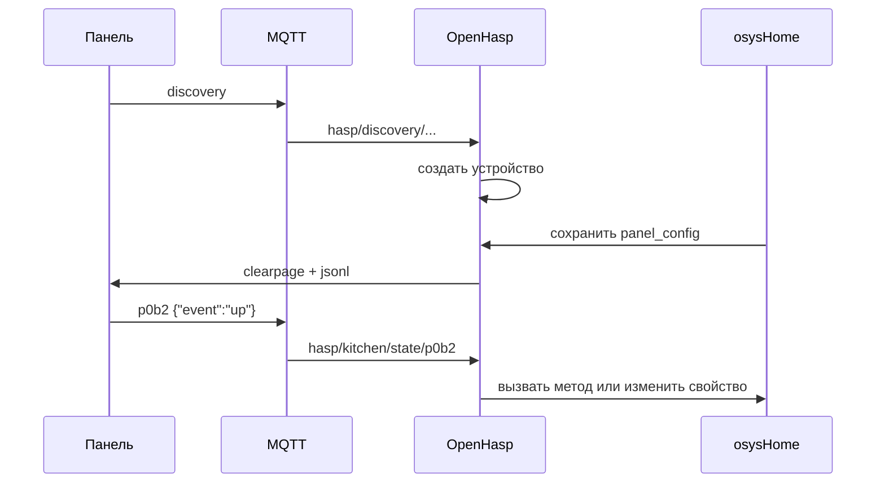

# OpenHasp - руководство пользователя

## 1. Назначение модуля

`OpenHasp` связывает сенсорные панели `openHASP` с `osysHome`. Панель получает интерфейс по MQTT, а события на экране могут менять свойства объектов и вызывать методы внутри системы.

## 2. Что понадобится

- настроенный MQTT-брокер;
- панель с прошивкой `openHASP`;
- доступ в административный интерфейс `osysHome`;
- объектная модель `osysHome`, если вы хотите использовать привязки `%Object.property%`.

## 3. Как плагин видит панель

После получения MQTT-сообщения `discovery` модуль создаёт запись устройства со следующими данными:

| Поле | Описание |
| --- | --- |
| `title` | Имя панели из MQTT discovery |
| `mqtt_path` | Корневой MQTT-путь панели, например `hasp/kitchen` |
| `ip` | IP-адрес из `statusupdate` |
| `current_page` | Текущая открытая страница |
| `online` | Онлайн-статус по `LWT` |
| `panel_config` | JSON-конфиг страниц и объектов |

## 4. Первичная настройка

### 4.1. Настройка MQTT

Откройте `OpenHasp -> Settings` и заполните поля:

| Поле | Что указать |
| --- | --- |
| `Host` | адрес MQTT-брокера |
| `Port` | обычно `1883` |
| `Login` | логин MQTT, если нужен |
| `Password` | пароль MQTT |
| `Topic` | список подписок через запятую |

Пример:

```text
Host: 192.168.1.10
Port: 1883
Topic: hasp/discovery/#,hasp/+/state/#,hasp/+/LWT,hasp/+/statusupdate,hasp/+/idle
```

### 4.2. Автообнаружение панели

Когда панель публикует `discovery`, плагин создаёт устройство автоматически. После этого панель появляется в списке модуля, и её можно открыть на редактирование.

Пример полезной части `discovery`:

```json
{
  "node": "Kitchen Panel",
  "node_t": "hasp/kitchen/"
}
```

На основе `node_t` в систему попадёт `mqtt_path = hasp/kitchen`.

## 5. Работа с устройством

В списке устройств доступны действия:

- `Reload pages` - повторно отправить все страницы панели;
- `Screenshot` - открыть скриншот устройства по HTTP;
- `Device UI` - перейти в Web UI панели;
- `Edit` - изменить `title`, `mqtt_path` и `panel_config`;
- `Delete` - удалить запись панели из базы.

## 6. Создание первой панели

### 6.1. Минимальный конфиг

Откройте устройство и вставьте в `Config` такой JSON:

```json
{
  "pages": [
    {
      "comment": "Главная",
      "objects": [
        {
          "id": 1,
          "obj": "label",
          "x": 10,
          "y": 10,
          "w": 220,
          "h": 40,
          "text": "openHASP подключен"
        },
        {
          "id": 2,
          "obj": "label",
          "x": 10,
          "y": 60,
          "w": 260,
          "h": 40,
          "text": "Страницы можно переключать из API или админки"
        }
      ]
    },
    {
      "comment": "Страница 2",
      "objects": [
        {
          "id": 1,
          "obj": "label",
          "x": 10,
          "y": 10,
          "w": 180,
          "h": 40,
          "text": "Вы на второй странице"
        }
      ]
    }
  ]
}
```

Сохраните конфиг и нажмите `Reload pages`.

### 6.2. Что произойдёт дальше

1. Плагин очистит страницы командой `clearpage`.
2. Для страницы будет отправлен `jsonl` с её параметрами.
3. Для каждого объекта будет отправлен `jsonl` с описанием виджета.
4. После загрузки страницу можно открыть через API или кнопки переключения в окне `Screenshot`.

## 7. Привязка к объектам osysHome

Плагин ищет в конфиге строки формата `%Object.property%` и:

- регистрирует связь при сохранении конфигурации;
- подставляет текущее значение в текст и свойства объектов;
- обновляет элементы панели, когда значение свойства меняется в `osysHome`;
- умеет принимать изменение с панели и отправлять его обратно в объектную модель.

Пример:

```json
{
  "pages": [
    {
      "objects": [
        {
          "id": 1,
          "obj": "label",
          "x": 10,
          "y": 10,
          "w": 220,
          "h": 40,
          "text": "Температура: %ClimateHall.temperature%C"
        },
        {
          "id": 2,
          "obj": "switch",
          "x": 10,
          "y": 60,
          "w": 100,
          "h": 50,
          "val": "%LightHall.state%"
        }
      ]
    }
  ]
}
```

Если `LightHall.state` изменится в системе, плагин сформирует команду обновления `p0b2.val`. Если пользователь изменит `switch` на панели, значение будет отправлено обратно в `LightHall.state`.

## 8. Вызов методов по нажатию

Для событий можно использовать `_linkedMethod`.

Пример кнопки:

```json
{
  "id": 3,
  "obj": "btn",
  "x": 10,
  "y": 130,
  "w": 180,
  "h": 60,
  "text": "Toggle light",
  "up_linkedMethod": "LightHall.toggle"
}
```

При событии `up` плагин вызовет метод `LightHall.toggle` в отдельном потоке.

## 9. Переключение страниц

Страницу можно открыть:

- через кнопку `Screenshot` в админке и переключатели страниц;
- через HTTP API.

> [!NOTE]
> В текущей реализации плагин не отправляет произвольные `*_command` обратно на панель. Для навигации по страницам используйте API, административный интерфейс или встроенную логику самой панели.

Пример API-запроса:

```http
GET /api/OpenHasp/page/3/1
```

Где:

- `3` - ID панели в базе;
- `1` - номер страницы.

## 10. Поведение при простое

Плагин отслеживает топик `idle`:

- если есть `idle_linkedProperty`, значение уходит в объектную модель;
- если привязки нет и панель присылает `long`, плагин гасит подсветку и рисует чёрную заглушку;
- если приходит `off`, заглушка удаляется, а яркость возвращается на `255`.

## 11. Практический сценарий запуска



## 12. Что проверять при диагностике

- панель появилась в списке устройств после `discovery`;
- `mqtt_path` в карточке совпадает с фактическим корнем MQTT панели;
- в `Topic` включены все нужные подписки;
- `panel_config` содержит валидный JSON;
- идентификаторы `id` уникальны внутри страницы;
- `%Object.property%` ссылаются на реально существующие объекты и свойства;
- после изменения конфигурации выполнен `Reload pages`.

## 13. Что дальше

После первой рабочей страницы переходите к документу [Настройка панелей и примеры конфигурации](PANEL_CONFIGURATION.ru.md), там собраны шаблоны, модальные блоки, linked-свойства и более полные примеры.
