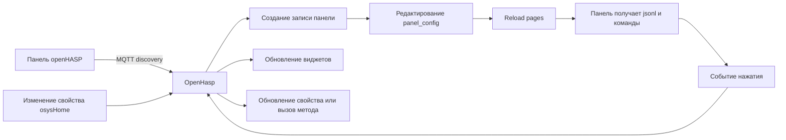

# OpenHasp - документация

Этот раздел описывает работу плагина `OpenHasp` в `osysHome`: от подключения панели до создания страниц, шаблонов и привязок к объектам системы.

## Состав документации

| Документ | Назначение |
| --- | --- |
| [README.ru.md](../README.ru.md) | Краткий обзор модуля, возможности и быстрый старт |
| [USER_GUIDE.ru.md](USER_GUIDE.ru.md) | Пошаговая работа с модулем в интерфейсе администратора |
| [PANEL_CONFIGURATION.ru.md](PANEL_CONFIGURATION.ru.md) | Формат `panel_config`, события, шаблоны и примеры JSON |

## Сценарий работы

## Когда какой документ использовать

- Если нужно быстро подключить первую панель, начинайте с [руководства пользователя](USER_GUIDE.ru.md).
- Если нужно собрать собственный JSON-конфиг, переходите в [документацию по настройке панелей](PANEL_CONFIGURATION.ru.md).
- Если нужно понять ограничения текущей реализации, сначала посмотрите `README`, затем разделы с примечаниями в профильных документах.

> [!TIP]
> Сначала удобно сделать простую страницу из 2-3 объектов без шаблонов, проверить доставку MQTT-команд, а уже потом добавлять `linkedProperty`, `linkedMethod` и `templates`.
